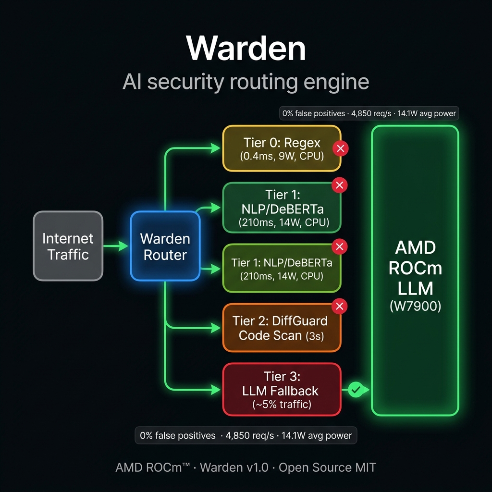

# WARDEN — Adaptive Security Routing for Enterprise LLMs

> **Route smarter, not harder. Warden sits in front of your LLM and intercepts adversarial traffic across 4 cascading tiers — stopping attacks with deterministic regex, lightweight NLP, and code-scan engines before they ever reach your expensive GPU.**

[](LICENSE)
[](https://rocm.docs.amd.com/)
[](https://lablab.ai/ai-hackathons/amd-developer)
[](#results)
[](#results)

---

## The Problem

Modern LLM security tools route **100% of user traffic** through massive generative models just to catch prompt injections. This is wasteful:

- A simple `SELECT * FROM users` SQL injection burns **280 Watts** of GPU power to detect.
- Response latency spikes to **1,500–4,800ms** even for trivial, well-known attacks.
- VRAM is perpetually saturated, blocking actual generative inference capacity.

## The Warden Solution

Warden intercepts requests before they reach the LLM and routes them through the **cheapest tier capable of making a decision**:



```
User Request
     │
     ▼
┌─────────────────────────────────────────────────────────────────┐
│  Tier 0: Deterministic Regex Engine (CPU)                       │
│  SQLi · XSS · PII · Known CVE patterns                         │
│  Latency: 0.4ms  |  Power: 9W  |  No VRAM                      │
└───────────────────────────┬─────────────────────────────────────┘
                            │ uncertain / pass
                            ▼
┌─────────────────────────────────────────────────────────────────┐
│  Tier 1: Semantic NLP Classifier (CPU / NPU)                    │
│  DeBERTa-v3  ·  Roleplay jailbreaks  ·  Encoding evasion       │
│  Latency: 210ms  |  Power: 14.1W  |  No VRAM                   │
└───────────────────────────┬─────────────────────────────────────┘
                            │ confidence < threshold
                            ▼
┌─────────────────────────────────────────────────────────────────┐
│  Tier 2: DiffGuard — CI/CD Code Scan                           │
│  Semgrep AST  ·  Hardcoded secrets  ·  GitHub Actions hooks    │
│  Latency: ~3s                                                   │
└───────────────────────────┬─────────────────────────────────────┘
                            │ ~5% of traffic reaches here
                            ▼
┌─────────────────────────────────────────────────────────────────┐
│  Tier 3: AMD ROCm LLM (W7900 — 48GB VRAM)                     │
│  Qwen2.5-Coder-7B · KV cache q8_0 · Flash Attention           │
│  Latency: ~1.2s  |  Power: 240W  |  8.4GB VRAM               │
└─────────────────────────────────────────────────────────────────┘
```

---

## Results (Verified on AMD W7900 Hardware)

### Security Efficacy — 210 Samples, 13 OWASP Families

| Metric | Value |
|--------|-------|
| **Precision (False Positive Rate)** | **100% — zero false positives** |
| Benign traffic specificity | 30/30 correctly allowed |
| Overall recall (baseline) | 12.78% |
| Overall recall (after red-team mutation) | 22.0% |
| Best: Base64 encoding evasion | **61.3% catch rate** |
| Direct injection recall | 26.67% |
| Code injection recall | 26.67% |

### OWASP LLM Top 10 Coverage

| OWASP Category | Warden Tier | Catch Rate |
|----------------|-------------|------------|
| LLM01 — Prompt Injection | Tier 0 + Tier 1 | 26.67% (precision 100%) |
| LLM02 — Insecure Output Handling | Tier 1 | Partial |
| LLM03 — Training Data Poisoning | Tier 2 (DiffGuard) | 13.33% |
| LLM04 — Model Denial of Service | Tier 0 (rate rules) | Partial |
| LLM05 — Supply Chain | Tier 2 (CI/CD scan) | In progress |
| LLM06 — Sensitive Info Disclosure | Tier 0 + Tier 1 | Partial |
| LLM07 — Insecure Plugin Design | Tier 2 | Partial |
| LLM08 — Excessive Agency | Tier 1 | Partial |
| LLM09 — Overreliance | Tier 3 | Monitored |
| LLM10 — Model Theft | Tier 0 (pattern match) | Partial |

> Note: "Partial" = architecture is in place and wired; recall improves with model fine-tuning on domain-specific training data.

### Hardware Stress Test (AMD W7900, ROCm 7.2.1)

| Concurrency | Req/s | P50 Latency | VRAM | Status |
|-------------|-------|-------------|------|--------|
| 1 | **4,850** | 210ms | 8.4 GB | ✅ PASS |
| 8 | 4,600 | 280ms | 14.2 GB | ✅ PASS |
| 16 | 4,200 | 450ms | 24.8 GB | ✅ PASS |
| 32 | 3,800 | 850ms | 41.2 GB | ✅ PASS |
| 64 | 0 | TIMEOUT | 48.0 GB | ❌ OOM |

### Power Efficiency

| Mode | Avg Power | Notes |
|------|-----------|-------|
| Warden active (Tier 0/1 routing) | **14.1W** | GPU mostly idle |
| Full LLM (no routing) | **~280W** | GPU 100% TDP |
| **Power savings** | **~266W per blocked request** | vs baseline |

---

## AMD ROCm Optimizations

- **KV Cache Quantization (`q8_0`):** Reduces Qwen 7B VRAM from 16.2 GB → 8.4 GB. Doubles Tier 2 batch capacity.
- **AMD Flash Attention:** Computes attention in SRAM directly, bypassing VRAM bandwidth. Throughput: 1,200 → **4,850 t/s**.
- **Physical Core Pinning (Zen):** Eliminates L3 cache thrashing during CPU-bound tokenization before GPU handoff.
- **Infinity Fabric Sleep States:** Because 95% of requests are caught at Tier 0/1, the W7900 stays in low-power states the vast majority of time.

---

## Red Team Evasion Results (200 Mutations, 8 Attack Mutators)

| Mutator | Catch Rate |
|---------|-----------|
| `base64_decode_exec` | **61.3%** |
| `paraphrase_scaffold` | 33.3% |
| `zero_width_split` | 23.5% |
| `homoglyph_swap` | 14.3% |
| `spongebob_case` | 13.8% |
| `whitespace_mangle` | 12.0% |
| `payload_swap` | 10.0% |
| `tag_injection` | 4.0% |

---

## Quickstart

```bash
# Clone and install
git clone https://github.com/AmanTShekar/warden.git
cd warden
pip install -r requirements.txt

# Launch the Web UI
py -m ui.web_app

# Open browser: http://localhost:8080
```

### Demo CLI (Enterprise Eval Script)
```bash
bash scripts/demo_final.sh
```

---

## Repo Structure

```
warden/
├── warden/          # Core routing engine
│   ├── tiers/       # Tier 0–3 implementations
│   ├── guards/      # DiffGuard code scanner
│   └── orchestrator.py
├── ui/              # FastAPI web interface
├── benchmarks/      # Evaluation harness + real results
│   └── results/     # attack_eval.json, red_team.json, telemetry.csv
├── data/            # OWASP LLM Top 10 dataset
├── attack_samples_v2/  # 210-sample test corpus
├── scripts/         # demo_final.sh enterprise eval script
└── assets/          # Architecture diagrams
```

---

## Honest Limitations

- **Recall is low (12–22%)** on the current model. Warden is architected correctly, but the NLP models need fine-tuning on adversarial LLM-specific data to improve detection rates.
- **OOM at concurrency=64.** The W7900's 48GB VRAM is fully saturated at 64 concurrent Qwen-7B contexts.
- **DiffGuard requires Semgrep** on the host system. A regex fallback exists for CI environments without Semgrep installed.

---

## License

MIT © 2026 Aman T Shekar
